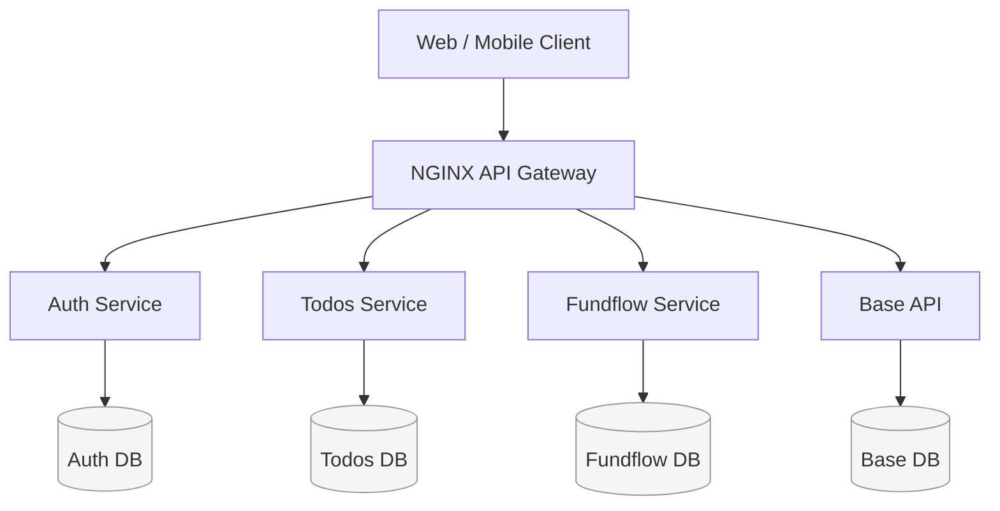

# API-Gateway-based Microservices Architecture

## Architecture Overview
This system follows an **API-Gateway-based Microservices Architecture with Database-per-Service isolation**. Each backend service owns its runtime, data, and deployment lifecycle. An NGINX API Gateway acts as the single public entry point.

This design avoids schema coupling, enables independent scaling, and provides a clean evolution path toward async and event-driven systems.

---

## Mermaid – High-Level Architecture

---

## What This Architecture IS

- Microservices Architecture
- API Gateway Pattern (NGINX)
- Database-per-Service Pattern
- Container-first (Docker Compose)
- Synchronous HTTP communication

---

## What This Architecture Is NOT

- ❌ Modular Monolith
- ❌ Shared Database Architecture
- ❌ SOA / ESB-based system
- ❌ Event-driven (yet)
- ❌ Serverless

---

## Core Components

### API Gateway (NGINX)
- Single public entry point
- Path-based routing
- Hides internal topology
- Ready for auth, rate limiting, TLS

### Backend Services
- One business domain per service
- Independently deployable
- No shared runtime or database

### Databases
- PostgreSQL per service
- Strong data ownership
- Independent migrations

---

## Key Features

- Independent deployments
- Fault isolation
- Zero schema coupling
- Horizontal scalability
- Clear ownership boundaries

---

## Evolution Path

- Add async messaging (Redis Streams / Kafka)
- Introduce service-level observability
- Add auth & rate limiting at gateway
- Migrate to Kubernetes when needed

---

**Architecture Name:**  
> API-Gateway-based Microservices Architecture with Database-per-Service

